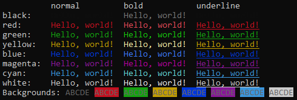

# colorfy
Easy colored terminal



# Usage
```python
from colorfy import *

#initialize()    If you're using Windows

print(colorfy('Hello, green!', color='green', bold=True))
```

# Instalation
Works with Windows and Linux
```
pip install https://github.com/x8ss/colorfy/archive/master.zip
```
